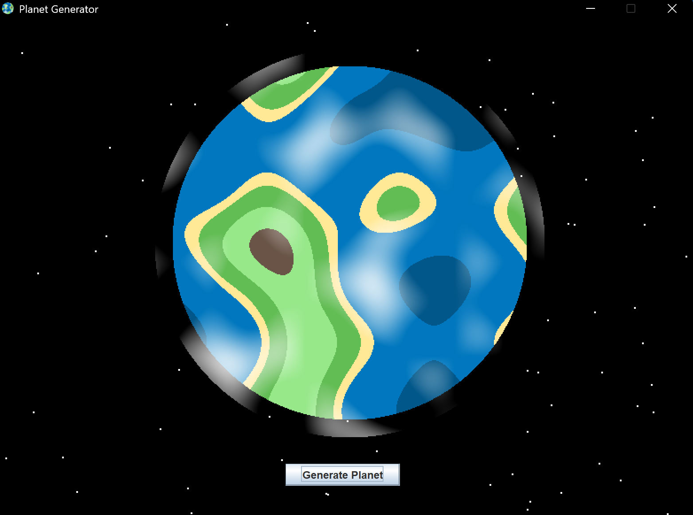

   <pre>
   ___  _      __  _____   _         __  
  / _ \/_\    /__\/ _  /  /_\/\   /\/ /  
 / /_)//_\\  / \//\// /  //_\\ \ / / /   
/ ___/  _  \/ _  \ / //\/  _  \ V / /___ 
\/   \_/ \_/\/ \_//____/\_/ \_/\_/\____/ 
   </pre>                                         
                                         

I'm a developer, designer, and builder who enjoys creating software, hardware projects, and web tools.

## Procedural Planet Generator

https://github.com/rowangriffin86-arch/Procedual2dPlanets

## What I'm Working On

* Full-stack web applications
* Desktop software
* UI/UX design
* Hardware and embedded projects

## Featured Projects

### Lintel

A customizable desktop top bar designed to bring useful information and controls to your workflow.

### Toolbox

A collection of web-based utilities built to solve everyday problems quickly and efficiently.

## Tech Stack

* Java
* JavaScript
* HTML/CSS
* Python

## Contact

Feel free to explore my repositories and follow my progress as I continue building new projects.
